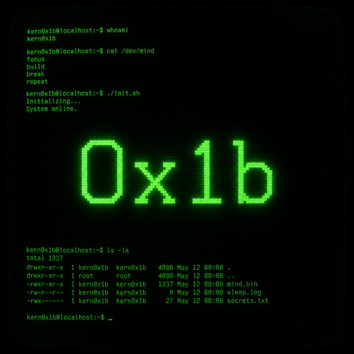

# Legacy iOS Tweaks — Cydia repo

[](LICENSE)


A single Cydia source aggregating MobileSubstrate tweaks for jailbroken
legacy iOS devices. Pure distribution point — no tweak source code lives
here, only built `.deb`s and the package index.

## Install

Cydia → Sources → Edit → Add:

```
https://kern0x1b.github.io/cydia/
```

## Published tweaks

| Package | Source repo | Fixes |
|---|---|---|
| `space.kern0x1b.expectfix` — Kindle Whispersync Fix | [kindle-sync-fix](https://github.com/kern0x1b/kindle-sync-fix) | Amazon Kindle app sync failing with 417 Expectation Failed |
| `space.kern0x1b.soundcloudfix` — SoundCloud iOS 6 Fix | [soundcloud-fix](https://github.com/kern0x1b/soundcloud-fix) (private) | SoundCloud 2.7.2 broken by the v1 API deprecation and dead password OAuth grant |

## Repo layout

```
Packages / Packages.gz   dpkg-scanpackages index over debs/
Release                  repo metadata
CydiaIcon.png            repo icon
debs/                    built .deb files, copied in manually on publish
```

## Publishing a new tweak here

1. Build the `.deb` in the tweak's own repo (see that repo's README).
2. From here:
   ```
   cp <tweak-repo>/dist/*.deb debs/
   dpkg-scanpackages debs /dev/null > Packages
   gzip -k -f Packages
   git add debs Packages Packages.gz
   git commit -m "Publish <tweak-name>"
   git push
   ```
3. Add a row to the table above.

Everything under `debs/`, `Packages`, and `Packages.gz` is regenerated by
that command — never hand-edit `Packages` directly.

## Contributing

Want your tweak listed here? Open a PR adding a row to the table above with
your `.deb` published under `debs/` and its own source repo linked.

## License

This repo (index, icon, tooling) is MIT, see [LICENSE](LICENSE). Each
published tweak carries its own license in its own source repo.
